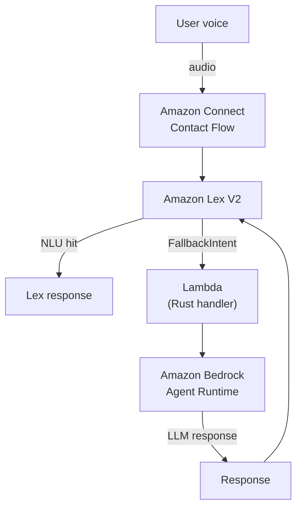

PoC‑VectorSearchModelComparer‑GpoSalinas / lambda‑lex‑agent
===============================================================

Rust λ  →  Amazon Lex V2  →  Amazon Bedrock Agent
“A serverless shim that lets an Amazon Lex bot fall back to a Bedrock Agent when its own NLU cannot answer the user.”

---

TABLE OF CONTENTS

1. High‑level flow
2. Repository layout
3. How it works
4. Prerequisites
5. Build & deploy
6. Local invocation
7. Runtime environment
8. Observability
9. Common issues
10. Cleaning up

---

1. HIGH‑LEVEL FLOW
   

   ```text
                   +------------------+
     User (voice)  |  Amazon Connect  |
           ───────▶|   Contact Flow   |
                   +---------┬--------+
                             │
                             │ (audio)
                             ▼
                   +------------------+
                   |   Amazon Lex V2  |
                   +---┬---------┬----+
                       │         │
             NLU hit   │         │  NLU miss / FallbackIntent
                       │         ▼
                       │   +-----------------------------+
                       │   | Lambda (Rust)               |
                       │   |  └─ Calls Bedrock Agent     |
                       │   +-------------┬---------------+
                       │                 │
                       │                 ▼
                       │      +---------------------+
                       │      | Amazon Bedrock      |
                       │      |   Agent Runtime     |
                       │      +---------┬-----------+
                       │                │
                       │                ▼
                       │       (LLM‑backed response)
                       └─────────────────────────────┘
   ```
2. REPOSITORY LAYOUT
   - src/main.rs               – Lambda handler in Rust (Tokio async, Bedrock SDK)
   - template.yaml             – AWS SAM template (build + IAM + Lambda)
   - Makefile                  – Convenience targets (build, deploy, invoke, logs)
   - events/test-event.json    – Canonical Lex V2 fallback payload for local tests
   - env.json                  – Local overrides for AGENT_ID / ALIAS / REGION
   - Cargo.toml                – Rust crate metadata & dependencies
   - samconfig.toml            – Default SAM deploy parameters
3. HOW IT WORKS
   - Lex triggers the Lambda when the bot enters FallbackIntent.
   - Lambda extracts:
      - inputTranscript  (raw user utterance)
      - sessionAttributes.CustomerId  (phone #, used as Bedrock session key)
         - Lambda calls InvokeAgent on Bedrock Agent Runtime SDK:
      - agent_id & agent_alias_id from env vars
      - session_id = sanitized CustomerId (keeps chat history)
         - SDK streams ResponseStream::Chunk events; Lambda concatenates chunks.
         - Lambda returns a Lex‑compatible JSON:
      - dialogAction.type = Close
      - messages[0].content = LLM answer
         - No state is stored in Lambda; conversation history lives in Bedrock.
         
4. PREREQUISITES
   - Rust 1.74 (stable)            – compile binary
   - cargo‑lambda 1.2              – cross‑compile for aarch64‑unknown-linux-musl
   - AWS SAM CLI 1.114             – build, deploy, local invoke
   - Docker 20.10+                 – SAM build container
   - AWS CLI 2.15+                 – log tailing & manual invokes
   - IAM credentials               – bedrock:InvokeAgent, lambda:*, cloudformation:*
5. BUILD & DEPLOY

# One‑liner

  make run              # clean → build → deploy → test invoke

# Step‑by‑step

  - make build            # sam build --beta-features
  - make config-deploy    # sam deploy with parameter overrides
  - make online-invoke    # invoke the deployed Lambda with test payload

  Tip: On macOS “too many open files” → use `make highlimit-run`.

6. LOCAL INVOCATION
   - make local-invoke     # run with events/test-event.json
   - make logs             # tail CloudWatch logs

  SAM spins up Lambda RIE in Docker; env vars injected from env.json.

7. RUNTIME ENVIRONMENT VARIABLES
   - AGENT_ID         – Bedrock Agent ID        (e.g. abc123def)
   - AGENT_ALIAS_ID   – Bedrock Agent Alias     (e.g. TSTALIAS)
   - BEDROCK_REGION   – Service region          (e.g. us-east-1)

  Set in three places (override order):
 - CloudFormation/Lambda (template.yaml)
 - env.json for sam local invoke
 - Shell exports (see make print-env)

8. OBSERVABILITY
   - 🚀  Lambda is starting up
   - 📥  Received event: ...
   - 🎯  Detected intent: ...
   - ✅  Bedrock Agent successfully invoked.
   - 📦  Received chunk: ...
   - ✅  End of response / ⚠️ Empty response

  Logging via `tracing` + `tracing-subscriber`. JSON logs supported.

9. COMMON ISSUES
   - “AGENT_ID must be set”            → env var missing → update stack & redeploy
   - 403 AccessDeniedException         → IAM role lacks bedrock:InvokeAgent
   - Empty response string             → Agent returned no chunks; enable trace
   - Speech input but no Lex response  → Contact flow barge‑in; verify Connect
10. CLEANING UP
    `sam delete --stack-name LambdaSalinasLexAgent --region us-east-1`

Built with love for serverless conversational‑AI experiments.



